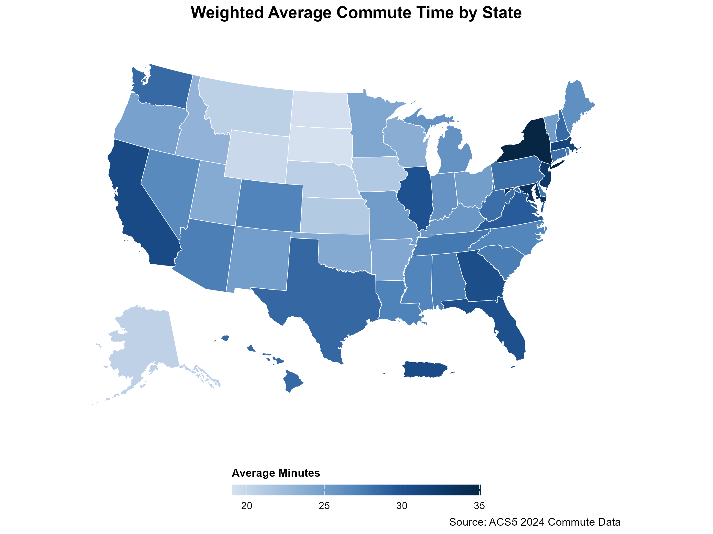

# ACS Mapping Demonstration

This repository contains demo materials, code examples, and resources from a public presentation on connecting to and mapping American Community Survey (ACS) data in R. The goal is to help R users access Census data, create informative maps, and build confidence working with spatial data.

You can request a [Census API key here](https://api.census.gov/data/key_signup.html). This is required for all data calls, learn more through the Census [resource library.](https://www.census.gov/library/video/2026/adrm/requesting-a-census-data-api-key.html)

---

## Opening this Project

- Download or clone this repository
- Open acs-mapping.Rproj
- Open the files from within the RStudio project, starting with setup

---

## Repository Structure

| Folder | Purpose |
|---|---|
| setup/ | Start here to install your packages and set your API key |
| demos/ | Live presentation and demo scripts for the webinar |
| examples/ | Reusable example scripts to explore ACS data and Census geographies on your own |

---

## Topics Covered

- Accessing ACS data with `tidycensus`
- Downloading shapefiles with `tigris`
- Joining data and geometry
- Creating choropleth maps using different geometries
- Styling maps with `ggplot2`
- Exploring demographic and socioeconomic patterns

---

## The included examples focus on practical, reproducible workflows using:

- The [tidycensus package](https://walker-data.com/tidycensus/) and [book Methods, Maps, and Models in R](https://walker-data.com/census-r/) for Census [data](https://data.census.gov/).
- The [tigris package](https://github.com/walkerke/tigris) for Census [shapefiles](https://www.census.gov/geographies/mapping-files/time-series/geo/tiger-line-file.html).
- The [censusapi package](https://www.hrecht.com/censusapi/) and [censusapi github](https://github.com/hrecht/censusapi), for data outside of ACS and Decennial.
- Packages from the [tidyverse](https://tidyverse.org/) such as dplyr, tidyr.
- Visualization packages such as ggplot2, [leaflet](https://rstudio.github.io/leaflet/), [mapview.](https://r-spatial.github.io/mapview/)
- Other formatting packages such as [scales](https://scales.r-lib.org/), [patchwork](https://patchwork.data-imaginist.com/articles/patchwork.html), and [sf.](https://r-spatial.github.io/sf/)

---

## Additional Resources

If you'd like to explore more advanced Census data analysis and mapping workflows in R, I highly recommend the SSDAN webinar series presented by Kyle Walker:

- [The 2025 SSDAN Webinar Series: Analyzing 2020 Census, 2023 ACS Data, and Mapping with R](https://ssdan.net/events/the-2025-ssdan-webinar-series-2023-acs-data-with-r-mapping-tools-and-the-2020-census/)

These webinars provide additional examples, techniques, and best practices for working with Census data in R.

---

## Now, try it yourself with the scripts in the examples folder

---

# Completely new to using R? Start here

## What You Need

Before using these examples, install the following tools.

---

## R

R is the programming language used throughout this project.

Download R here:

https://cran.r-project.org/

---

## RTools (Windows Only)

RTools provides additional tools needed to install and build some R packages on Windows.

Download RTools here:

https://cran.r-project.org/bin/windows/Rtools/

---

## RStudio

RStudio is an integrated development environment (IDE) that makes working with R easier.

Download RStudio here:

https://posit.co/download/rstudio-desktop/

---

## GitHub Account

GitHub is a platform used to store, share, and download code and projects.

Create a free account here:

https://github.com/

---

## GitHub Desktop

GitHub Desktop provides a simple way to download and manage GitHub repositories without using the command line.

Download it here:

https://desktop.github.com/

---

# Downloading This Repository

## Option 1: GitHub Desktop (Recommended)

1. Open GitHub Desktop
2. Sign in with your GitHub account
3. Select **File → Clone Repository**
4. Choose this repository from the list
5. Select a local folder on your computer
6. Click **Clone**

---

## Option 2: Download ZIP

1. Go to the repository page on GitHub
2. Click the green **Code** button
3. Select **Download ZIP**
4. Extract the ZIP file to your computer

---

# Opening the Project in RStudio

1. Open RStudio
2. Navigate to the folder where the repository was saved
3. Open the `.Rproj` file (if available)
4. Open `00_setup.R`
5. Uncomment lines 12 through 20 (remove the #) to install packages
6. Uncomment line 52 (remove the #) and add your API Key in place of the text 
7. Run the full script to install required packages and save your API key
8. After successfully getting output from line 70, put re-comment (add a #) lines 12 through 20 & 52. You only need to do this step once.

---

# Repository Structure

The files are meant to be completed in order:

| File | Purpose |
|------|--------|
| `setup/00_setup.R` | Installs required packages and prepares your environment |
| `demos/01_commute.Rmd` | Introduces the workflow and core concepts |
| `demos/02_ACS_examples.Rmd` | Uses the ACS API for analysis and visualization |
| `examples/practice_api.Rmd` | Independent exercise using the ACS API to reinforce data access skills |
| `examples/practice_shapefiles.Rmd` | Independent exercise focused on working with spatial data and shapefiles |

---

# First-Time Setup

Run the entire `00_setup.R` script before starting.

This script will:

- Install required R packages
- Load necessary libraries
- Install your unique API key to your R environment
- Verify your environment is working correctly

Once it completes successfully, proceed to `01_commute.Rmd`.

---

# Learning Path

## Step 1: Setup

Run `00_setup.R`

Goal: Ensure your environment is ready to use.

---

## Step 2: Commute Example

Open and complete `01_commute.Rmd`

Goal: Learn the workflow used throughout the project.

---

## Step 3: ACS Examples

Open `02_acs_examples.Rmd`

Goal: Learn how to access and visualize ACS data using R and APIs.

---

## Step 4: Practice on Your Own

Once you have completed the guided examples, try applying what you learned using the practice files in the `examples` folder.

Open and work through:

- `practice_api.R`
- `practice_shapefiles.R`

### Goal

These files are designed for independent practice. They will:

- Reinforce the concepts from earlier sections
- Give you a chance to troubleshoot on your own
- Help you become more comfortable working with ACS data and spatial data in R

If you get stuck, refer back to `02_ACS_examples.Rmd` for similar patterns and code examples.